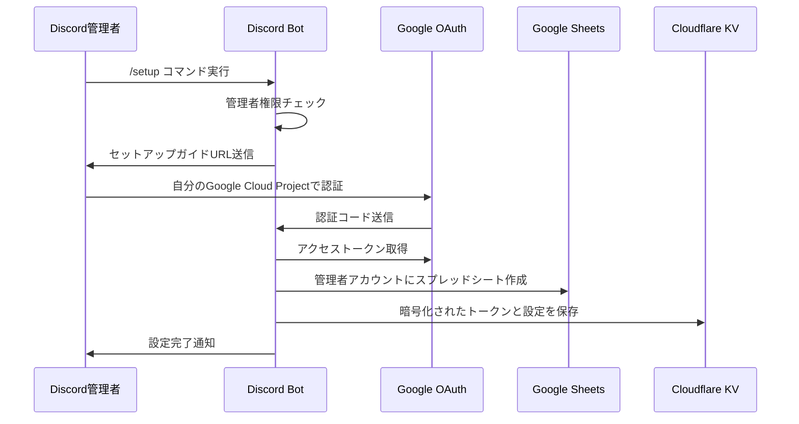

# 直接OAuth方式による勤怠管理Bot設定ガイド

## 📋 概要

このドキュメントは、各サーバー管理者が個別にGoogle OAuth認証を行う「直接OAuth方式」による勤怠管理Botの設定方法を説明します。この方式により、各サーバーの管理者が自分のGoogleアカウントでスプレッドシートを作成し、プライバシーとセキュリティを保護しながら勤怠管理を行えます。

## 🎯 実装方式の特徴

### ✅ メリット
- **完全なプライバシー保護**: 各サーバーのデータは管理者のGoogleアカウントに保存
- **高度なGoogle Sheets API機能**: リアルタイム処理、自動計算、詳細なデータ操作
- **セキュアなトークン管理**: 暗号化されたトークン保存
- **Bot開発者による設定不要**: Googleの認証情報設定が不要

### ⚠️ 注意点
- **セットアップの複雑さ**: 管理者がGoogle Cloud Projectを作成する必要
- **技術的要求**: Google Cloud Consoleの操作が必要
- **トークン管理**: リフレッシュトークンの自動更新

## 🔧 実装アーキテクチャ



## 🚀 セットアップ手順

### Step 1: Bot環境変数設定

Discord Bot開発者（あなた）が設定する環境変数：

```bash
# .dev.vars または Cloudflare Workers 環境変数
DISCORD_PUBLIC_KEY=your_discord_public_key
DISCORD_APPLICATION_ID=your_discord_application_id
DISCORD_TOKEN=your_discord_token
ALLOWED_CHANNEL_IDS=*
ENCRYPTION_KEY=your_32_character_encryption_key_here
```

**重要**: Google OAuth認証情報（`GOOGLE_CLIENT_ID`, `GOOGLE_CLIENT_SECRET`）は不要です。

### Step 2: Discord Botのデプロイ

```bash
# 型チェック
bun run tsc --noEmit

# デプロイ
bun run deploy
```

### Step 3: Discord Bot招待URL

適切な権限でBotをサーバーに招待するためのURL：

```
https://discord.com/api/oauth2/authorize?client_id=YOUR_CLIENT_ID&permissions=2147486720&scope=bot%20applications.commands
```

**必要な権限**:
- View Channels (チャンネル名取得)
- Send Messages (メッセージ送信)
- Use Slash Commands (スラッシュコマンド実行)

## 👥 ユーザー向け設定手順

### Step 1: Discordでのセットアップ開始

1. Discord サーバーで `/setup` コマンドを実行
2. 管理者権限を持つユーザーのみ実行可能
3. セットアップガイドページのURLが表示される

### Step 2: Google Cloud Project作成

セットアップガイドページで以下の手順を実行：

#### 1. Google Cloud Console にアクセス
- [Google Cloud Console](https://console.cloud.google.com/) にアクセス
- 新しいプロジェクトを作成（例: 「勤怠管理Bot用」）

#### 2. Google Sheets API の有効化
- 「APIとサービス」→ 「ライブラリ」
- 「Google Sheets API」を検索して有効化

#### 3. OAuth認証情報の作成
- 「APIとサービス」→ 「認証情報」
- 「認証情報を作成」→ 「OAuth クライアント ID」
- アプリケーションの種類：「ウェブアプリケーション」
- 承認済みのリダイレクトURI：
  ```
  https://kintai-discord-v2.r916nis1748.workers.dev/oauth/callback
  ```

### Step 3: 認証情報の入力

セットアップガイドページで：

1. 作成されたクライアントIDとクライアントシークレットを入力
2. 「認証を開始」ボタンをクリック
3. Googleアカウントで認証を完了
4. スプレッドシートが自動作成される

### Step 4: 設定確認

- `/status` コマンドで設定状況を確認
- スプレッドシートURLと接続状態が表示される

## 🔒 セキュリティ機能

### 1. トークン暗号化

```typescript
// 実装例: CryptoService
export class CryptoService {
  async encrypt(data: string): Promise<string> {
    const key = await crypto.subtle.importKey(
      "raw",
      new TextEncoder().encode(this.encryptionKey),
      { name: "AES-GCM" },
      false,
      ["encrypt"]
    );

    const iv = crypto.getRandomValues(new Uint8Array(12));
    const encrypted = await crypto.subtle.encrypt(
      { name: "AES-GCM", iv },
      key,
      new TextEncoder().encode(data)
    );

    // IV + 暗号化データを Base64 エンコード
    const result = new Uint8Array(iv.length + encrypted.byteLength);
    result.set(iv);
    result.set(new Uint8Array(encrypted), iv.length);
    return btoa(String.fromCharCode(...result));
  }
}
```

### 2. サーバー別データ分離

```typescript
// KV保存構造
{
  "server:{guild_id}": {
    "spreadsheet_id": "1BxiMVs0XRA5nFMdKvBdBZjgmUUqptlbs74OgvE2upms",
    "access_token": "encrypted_access_token",
    "refresh_token": "encrypted_refresh_token", 
    "sheet_url": "https://docs.google.com/spreadsheets/d/...",
    "owner_id": "123456789012345678",
    "created_at": "2025-06-28T12:00:00Z"
  }
}
```

### 3. 権限チェック

```typescript
// 管理者権限チェック（現在は簡易実装、今後改善予定）
function checkAdminPermissions(member: any, userId?: string, guildId?: string): boolean {
  // 1. サーバーオーナーチェック
  if (userId && guildId && userId === guildId) return true;
  
  // 2. 権限ビットフィールドチェック
  if (member.permissions) {
    const permissions = parseInt(member.permissions);
    const ADMINISTRATOR = 0x8;
    const MANAGE_GUILD = 0x20;
    
    return (permissions & ADMINISTRATOR) === ADMINISTRATOR || 
           (permissions & MANAGE_GUILD) === MANAGE_GUILD;
  }
  
  // 3. 開発・テスト用（一時的）
  return true; // 現在は全ユーザー許可
}
```

## 🛠️ 実装されたファイル構成

```
src/
├── types.ts                 # 型定義（OAuth対応拡張）
├── oauth-service.ts         # 直接OAuth実装
├── crypto-service.ts        # 暗号化サービス
├── sheets-service.ts        # Google Sheets API直接呼び出し
├── server-config-service.ts # サーバー設定管理（暗号化対応）
├── discord-service.ts       # Discordコマンド処理
├── discord-api-service.ts   # Discord API呼び出し
├── index.ts                # メインアプリケーション（OAuth URL、セットアップガイド）
└── utils.ts                # ユーティリティ関数
```

## 📊 利用可能なコマンド

### `/setup`
- **機能**: 初期設定開始
- **権限**: 管理者のみ
- **処理**: セットアップガイドURLを表示

### `/status`
- **機能**: 現在の設定状況確認
- **権限**: 全ユーザー
- **表示内容**: スプレッドシートURL、接続状態、設定詳細

### `/reset`
- **機能**: 設定の完全削除
- **権限**: 管理者のみ
- **処理**: 暗号化されたトークンと設定を削除

### `/start [time]`
- **機能**: 勤務開始記録
- **権限**: 全ユーザー
- **処理**: Google Sheets APIで直接記録

### `/end [time]`
- **機能**: 勤務終了記録
- **権限**: 全ユーザー
- **処理**: 勤務時間を自動計算してスプレッドシートに記録

## 🔄 データフロー

### 勤務開始記録
```
1. /start コマンド実行
2. サーバー設定をKVから取得
3. 暗号化されたアクセストークンを復号化
4. Google Sheets APIで直接記録
5. KVに一時状態を保存
6. Discord に成功メッセージ表示
```

### 勤務終了記録
```
1. /end コマンド実行  
2. KVから開始記録を取得
3. 勤務時間を自動計算
4. Google Sheets APIで終了時刻と勤務時間を更新
5. KVから一時状態を削除
6. Discord に勤務時間を含む完了メッセージ表示
```

## 🚨 トラブルシューティング

### よくあるエラーと解決方法

#### 1. `redirect_uri_mismatch`
**原因**: Google Cloud ConsoleのリダイレクトURIが不正
**解決**: 以下のURLを正確に設定
```
https://kintai-discord-v2.r916nis1748.workers.dev/oauth/callback
```

#### 2. 「管理者権限が必要です」
**原因**: ユーザーに適切な管理者権限がない
**解決**: サーバー管理者権限を持つユーザーで実行

#### 3. スプレッドシート作成エラー
**原因**: Google Sheets APIが有効でない、または権限不足
**解決**: Google Cloud ConsoleでAPIを有効化

#### 4. トークン期限切れエラー
**原因**: アクセストークンの有効期限切れ
**解決**: 自動リフレッシュ機能が実装済み（通常は自動で解決）

### デバッグ方法

```bash
# Cloudflare Workers ログ確認
wrangler tail

# 型チェック
bun run tsc --noEmit

# 本番環境確認
curl -X POST https://kintai-discord-v2.r916nis1748.workers.dev/api/interactions
```

## 📈 パフォーマンス特性

### 処理速度
- **OAuth認証**: 初回のみ、約5-10秒
- **勤務記録**: 1-2秒（Google Sheets API直接呼び出し）
- **設定確認**: 0.5秒以下（KVキャッシュ利用）

### スケーラビリティ
- **同時サーバー数**: 理論上無制限
- **ユーザー数**: サーバーあたり無制限
- **データ保存**: サーバー別完全分離

### セキュリティ特性
- **暗号化**: AES-GCM 256bit
- **トークン有効期限**: 1時間（自動リフレッシュ）
- **データ分離**: サーバーID基準の完全分離

## 🔮 今後の改善予定

### 短期（1-2週間）
- [ ] 管理者権限チェックの強化
- [ ] エラーメッセージの詳細化
- [ ] 接続テスト機能の追加

### 中期（1-2ヶ月）
- [ ] トークンリフレッシュの完全自動化
- [ ] 複数スプレッドシート対応
- [ ] データエクスポート機能

### 長期（3-6ヶ月）
- [ ] Discord Bot公式リスト掲載
- [ ] 多言語対応
- [ ] 分析・レポート機能

## 📞 サポート

### 設定支援
- セットアップガイドページに詳細な手順を記載
- トラブルシューティングセクション付き

### 技術サポート
- GitHub Issues でのバグ報告
- Discord サーバーでのコミュニティサポート（今後予定）

---

**最終更新**: 2025年6月28日  
**実装バージョン**: v2.0 (直接OAuth方式)  
**互換性**: Cloudflare Workers, Discord API v10, Google Sheets API v4
